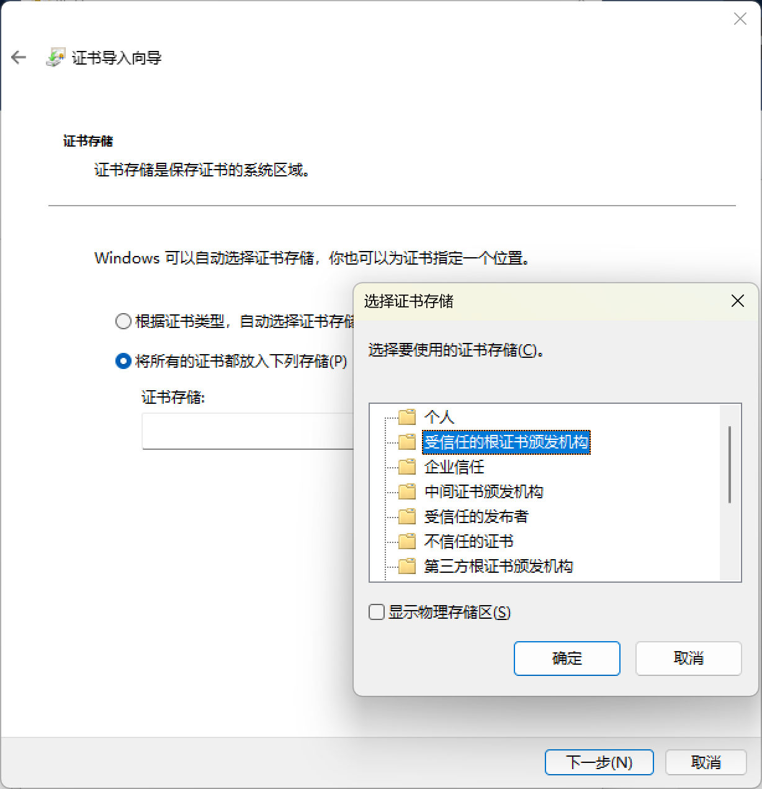

# steam-cdn-redir
重定向Steam的下载CDN为境内CDN


羽翼城大佬的同类软件以及失效无法使用一段时间了，一直没有相关软件添加这个功能，所以自己简单地实现一下这个功能  
由于本人并非计算机专业，对Python了解较少，对Javascript完全不了解，所以代码实现的方式可能很不规范，还请见谅，这个程序算是抛砖引玉，希望后续有大佬开发更完整的软件  
CDN token的获取基于[DoctorMcKay/node-steam-user](https://github.com/DoctorMcKay/node-steam-user)项目


# 下载
[github](https://github.com/FrankeyLing/steam-cdn-redir/releases/download/0.1/steam_cdn_redir.zip)&nbsp;&nbsp;[百度网盘](https://pan.baidu.com/s/1nEKiza4AakPI2p-39t2ylg?pwd=7ypx)

# 使用方法
由于steam的CDN用了https，所以首先需要安装CA证书，可直接双击安装，请把证书放在受信任的根证书颁发机构下  


由于token的获取是基于[DoctorMcKay/node-steam-user](https://github.com/DoctorMcKay/node-steam-user)，需要安装[Node.js](https://nodejs.org/en/download)并正确配置环境变量  
如果不配置环境变量则需要修改listen.py中的node_path为node.exe的路径


python环境请用以下命令安装
```
pip install -r requirements.txt -i https://pypi.tuna.tsinghua.edu.cn/simple
```

请在cdn_use.txt中对使用的CDN进行选择，用`#`注释掉所有其他的CDN，只留一个域名，如果不进行编辑的话默认是新流云


由于脚本会修改hosts，需要以管理员身份运行，请以管理员身份运行cmd，并
```
python main.py
```
或者直接双击"快捷运行.bat"  
当看到`Running on https://127.0.0.1:443`即代表程序开始运行  
当Steam进行下载时会在控制台输出重定向的链接，可以通过此方式判断运行是否成功


当结束运行时请手动按Ctrl+C，并再按Enter恢复hosts退出，**不要直接叉掉控制台**，不然备份的hosts将无法恢复，需要手动编辑


# 关于CA证书
如果对我提供的CA证书不放心的话可以自己用openssl生成一个，可使用项目中的ca.cnf生成，用生成的ca.crt和ca.key替换掉目录下的即可  
```
openssl req -new -x509 -days 3650 -keyout ca.key -out ca.crt -config ca.cnf
```
